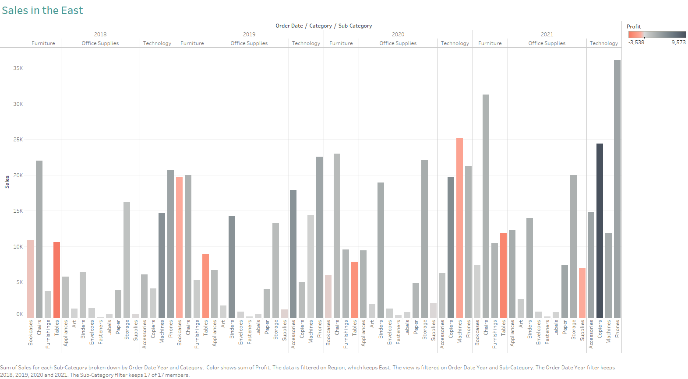

```{r setup, include=FALSE}
knitr::opts_chunk$set(echo = TRUE)
```

## Git, GitHub

1. *What is your GitHub username?*
  KCossey
  
  2. *What is the URL of your remote GitHub repo (created through Mr. Kennedy's exercises)?*
  https://github.com/KCossey/CS625-FA21-HW1

## R

The command below will load the tidyverse package.  If you have installed R, RStudio, and the tidyverse package, it should display a list of loaded packages and their versions.
```{r}
library(tidyverse)
```

## R Markdown 

1. *Create a bulleted list with at least 3 items*
* Item 1
* Item 2
* Item 3

2. *Write a single paragraph that demonstrates the use of italics, bold, bold italics, code, and includes a link. The paragraph does not have to make sense.*

There are **many** great R websites. One of the most *helpful* websites is [www.r-bloggers.com](www.r-bloggers.com). *You can **find help** to fix codes like this:*
```{r}
test <- data.frame(a = 1:4, b = 5:8)
view(test)
```

3. *Create a level 3 heading*

### APA 7th Edition Headings, Page 48: Level 3 - *Flush Left, Bold Italic, Title Case*

## R 

#### Data Visualization Exercises

1. (Q2) *How many rows are in mpg? How many columns?*
        234 rows, 11 columns

2. (Q3)  *What does the 'drv' variable describe?
        Drive train - 4-wheel, front wheel, rear wheel

3. (Q4) *Make a scatterplot of hwy vs cyl.*
```{r}
ggplot(data = mpg) +
  geom_point(mapping = aes(x = hwy, y = cyl))
```

Not particularly useful - 'cyl' is a ordinal (integer), not continuous (numeric) variable. Could be useful to check for outliers, since higher cylinder numbers have some relationship to lower highway mpg. 


#### Workflow: basics Exercises

1. (Q2) *Tweak each of the following R commands so that they run correctly (`library(tidyverse)` is correct):*

Incorrect code with comments on corrections
```r
library(tidyverse)
ggplot(dota = mpg) + ###'dota' misspelled, use 'data'
  geom_point(mapping = aes(x = displ, y = hwy))

fliter(mpg, cyl = 8) ###'fliter' misspelled, use 'filter'; must use "==" to show "exactly equals"
filter(diamond, carat > 3) ###No object named 'diamond', should be 'diamonds'
```

  Corrected code
```{r}
ggplot(data = mpg) + 
  geom_point(mapping = aes(x = displ, y = hwy))

filter(mpg, cyl == 8) 
filter(diamonds, carat > 3)
```

## Google Colab

1. *What are the URLs of your Google Colab notebooks (both Python and R)?*

**Python Notebook**: https://colab.research.google.com/drive/1cW7SgRuS7e620u5TOWpn6JhZB4AVrSeE?usp=sharing

**R Notebook**: https://colab.research.google.com/drive/1_HIXzMb0X4K9QLsUtlck_QzbbXL4xoqq?usp=sharing

## Tableau

*Insert your the image of your final bar chart here*



1. *What conclusions can you draw from the chart?*

* Bookcases were not profitable until 2021, and even then they were barely profitable.
* Copiers have been increasing in profitability.
* Envelopes, fasteners, and labels are consistently the lowest sellers and are only marginally profitable.
* Phones had a sharp spike in sales in 2021, but still generate approximately the same amount of profit as in all previous years.

## Observable and Vega-Lite

### A Taste of Observable

1. *In the "New York City weather forecast" section, try replacing `Forecast: detailedForecast` with `Forecast: shortForecast`. Then press the blue play button  or use Shift-Return to run your change. What happens?*

The detailed forecast sentences in the image were removed.

2. *Under the scatterplot of temperature vs. name, try replacing `markCircle()` with `markSquare()`. Then press the blue play button  or use Shift-Return to run your change. What happens? How about `markPoint()`?*

The command ".mark" is the shape of the points on the scatterplot. ".markSquare" creates square points, and ".markPoint" is a circle outline.  

3. *Under "Pick a location, see the weather forecast", pick a location on the map.  Where was the point you picked near?*

Jersey Village, TX - near my grandparents' house.

4. *The last visualization on this page is a "fancy" weather chart embedded from another notebook.  Click on the 3 dots next to that chart and choose 'Download PNG'.  Insert the PNG into your report.*


*Cannot download png from Observable notebook - the file saves as an empty file that can't be opened by anything. So far, Google has no useful information. Come back to this Monday morning. In the meantime, screenshot inserted instead.*


### Charting with Vega-Lite

`markCircle()`

1. *Pass an option of `{ size: 200 }` to `markCircle()`.*
1. *Try `markSquare` instead of `markCircle`.*
1. *Try `markPoint({ shape: 'diamond' })`.*

`vl.x().fieldQ("Horsepower")`, ...

1. *Change `Horsepower` to `Acceleration`*
1. *Swap what fields are displayed on the x- and y-axis*

`vl.tooltip().fieldN("Name")`

1. *Change `Name` to `Origin`.*

Another example, `count()`

1. *Remove the `vl.y().fieldN("Origin")` line.*
1. *Replace `count()` with `average("Miles_per_Gallon")`.*

## References

*Every report must list the references that you consulted while completing the assignment. If you consulted a webpage, you must include the URL.*

* Reference 1: R Markdown basics, [https://bookdown.org/yihui/rmarkdown/installation.html](https://bookdown.org/yihui/rmarkdown/installation.html)
* Reference 2: R Markdown Reference guide, [https://www.rstudio.com/wp-content/uploads/2015/03/rmarkdown-reference.pdf](https://www.rstudio.com/wp-content/uploads/2015/03/rmarkdown-reference.pdf)
* Reference 3: R Markdown code chunks, [https://www.dataquest.io/blog/r-markdown-guide-cheatsheet/](https://www.dataquest.io/blog/r-markdown-guide-cheatsheet/)
* Reference 4: Using R code in a Jupyter notebook, [https://nbviewer.jupyter.org/github/ipython/ipython/blob/1.x/examples/notebooks/Cell%20Magics.ipynb](https://nbviewer.jupyter.org/github/ipython/ipython/blob/1.x/examples/notebooks/Cell%20Magics.ipynb)
